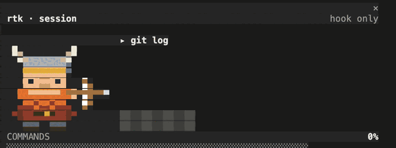
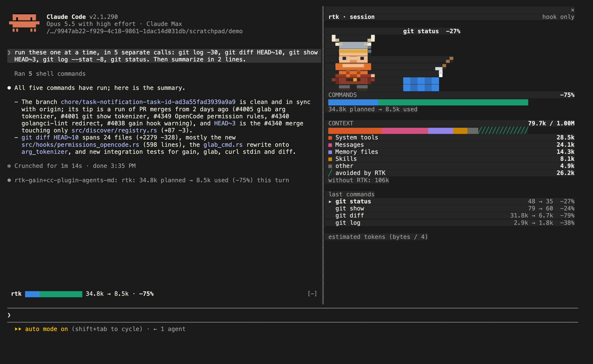
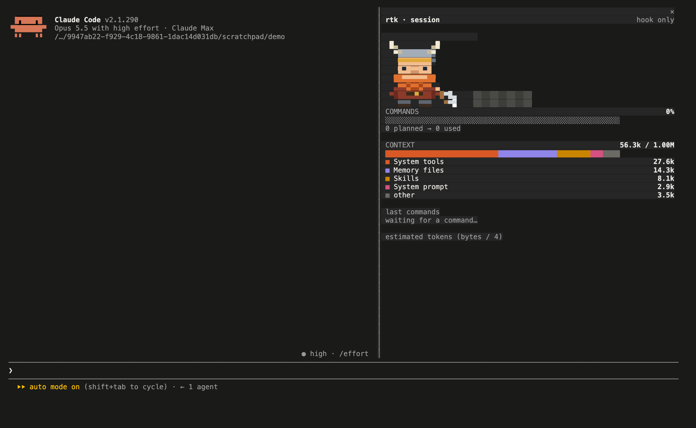
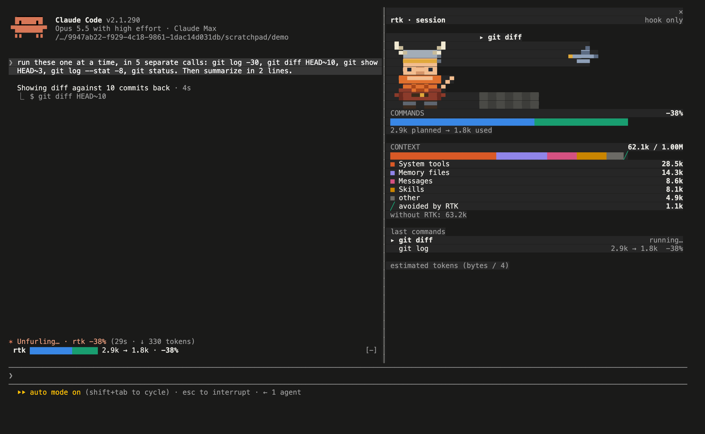
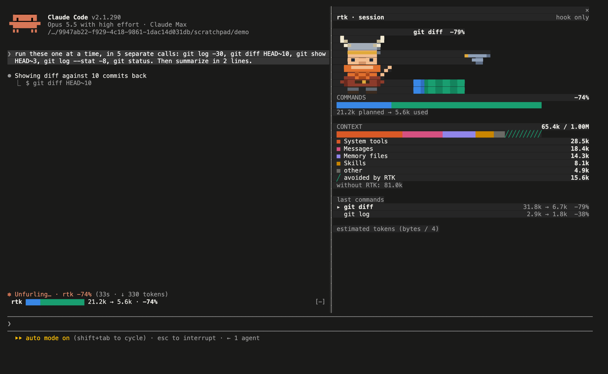
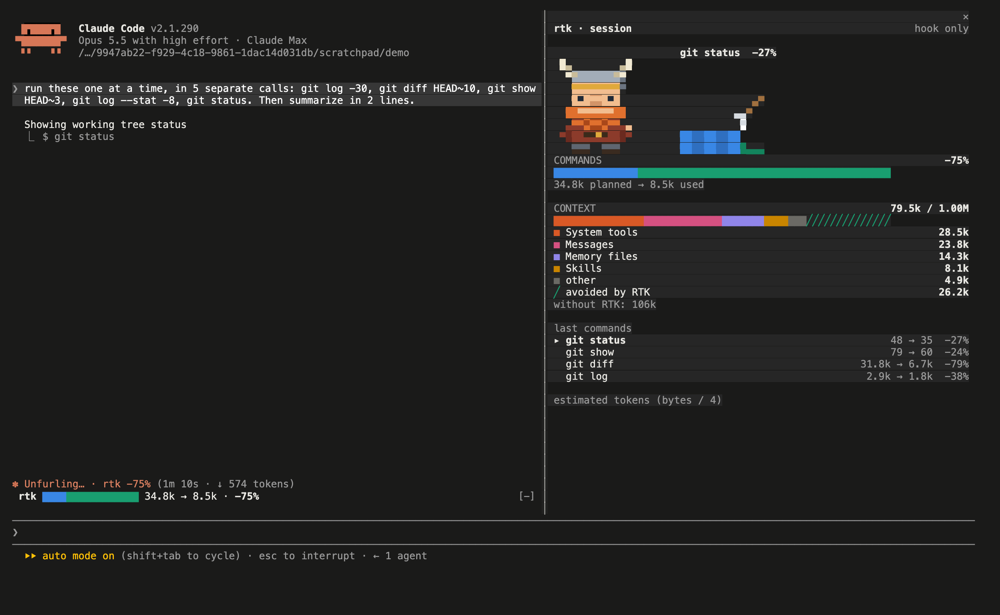

# rtk-gain : les gains RTK en direct dans Claude Code

Un mod Claude Code qui montre, pendant que Claude travaille, ce que [RTK](https://github.com/rtk-ai/rtk) fait gagner : une barre pour les commandes (prévu, utilisé, économisé), une barre pour la fenêtre de contexte décomposée par catégorie, et un viking qui casse les tokens économisés, avec une animation différente à chaque fois.

[English](README.md)



Testé avec Claude Code 2.1.290 dans le terminal. Les mods demandent Claude Code 2.1.287 ou plus dans le terminal, 2.1.286 dans l'app Desktop.

## Démarrage rapide

Avec `rtk` et son hook installés (`rtk init -g`), dans Claude Code :

```text
/plugin marketplace add rtk-ai/rtk-gain-mod
/plugin install rtk-gain@rtk
/rtk-gain
```

La dernière commande ouvre le panneau avec le viking ; il ne s'ouvre pas tout seul. Détails et autres façons d'installer dans [Installer](#installer).

## Ce que montre le mod

Trois endroits de Claude Code :

- **Le panneau**, ouvert avec `/rtk-gain` : le viking, les deux barres avec leurs légendes, et les dernières commandes avec leur gain propre. `/rtk-gain` une seconde fois, ou Échap, le ferme.
- **Le bandeau au-dessus du prompt** : une ligne, toujours visible dès qu'une commande est passée par rtk.
- **Le spinner** : le gain cumulé à la fin de la ligne pendant que Claude travaille, et une ligne sous chaque réponse avec le gain du tour.

Lecture des barres :

- **Commandes** : toute la barre est le prévu (ce que les commandes auraient renvoyé sans RTK). Bleu, l'utilisé ; vert, l'économisé.
- **Contexte** : ce qui remplit la fenêtre de contexte, par catégorie (les quatre plus grosses, le reste dans « autres »), tel que Claude Code le compte pour `/context`. La partie hachurée prolonge la barre de ce que RTK a évité : « sans RTK », le contexte serait à la somme des deux.



Sur ce tour, RTK a gardé 26,2 k tokens hors du contexte : 79,7 k au lieu de 106 k. Les captures sont en anglais ; le mod choisit sa langue tout seul (voir « Langues »).

## Le viking

En haut du panneau, un viking en pixel-art casse les tokens : deux pixels par case du terminal (le caractère `▀`, sa couleur pour le pixel du haut, son fond pour celui du bas).

Pendant qu'une commande tourne, il attend, arme levée, devant un bloc gris. Quand elle revient, il frappe le bloc de la commande à la coupe entre ce qui est gardé (bleu) et ce que RTK a économisé (vert), et la partie économisée est détruite. Le nom de la commande et son gain s'affichent au-dessus.

Il y a cinquante animations, dix attaques fois cinq façons de détruire la partie économisée :

| Attaques | Effets |
| :- | :- |
| hache, marteau, épée, lance, torche, deux haches, hache lancée, arc, foudre, corbeau | éclats, explosion, fonte, poussière, balayage |

Une animation est tirée au hasard à chaque commande, jamais la même attaque ni le même effet deux fois de suite. Un gros gain penche vers les effets bruyants (éclats, explosion, balayage), un petit vers les effets calmes (fonte, poussière) ; les cinquante restent possibles.

Le viking n'apparaît que dans le terminal : le texte de l'app Desktop n'est pas forcément en chasse fixe, et le dessin s'y déferait.

## Captures

Toutes prises dans une vraie session Claude Code 2.1.290, sur un clone du dépôt `rtk`, avec le hook RTK installé. Claude a lancé `git log -30`, `git diff HEAD~10`, `git show HEAD~3`, `git log --stat -8` et `git status`.

| | |
| :- | :- |
|  |  |
| 1. `/rtk-gain` à l'ouverture : le viking au repos, le contexte de départ, aucune commande. | 2. Claude lance `git diff` : le viking prépare son attaque, la commande apparaît en cours. |
|  |  |
| 3. Le retour de `git diff` : la frappe tombe sur la coupe et les barres montent vers leur nouvelle valeur. | 4. Après les commandes : `git diff` 31,8 k → 6,7 k (−79 %), `git log` 2,9 k → 1,8 k (−38 %). |

## Installer

Il faut Claude Code 2.1.287 ou plus, `rtk` dans le `PATH`, et le hook RTK installé (`rtk init -g`) : sans le hook, aucune commande ne passe par RTK, et le panneau le dit.

1. Installer le mod depuis le catalogue de ce dépôt :

   ```text
   /plugin marketplace add rtk-ai/rtk-gain-mod
   /plugin install rtk-gain@rtk
   ```

   Ou, pour une session seulement, sans installer :

   ```bash
   git clone https://github.com/rtk-ai/rtk-gain-mod.git
   claude --plugin-dir ./rtk-gain-mod
   ```

   `/plugin` affiche `1 mod active · rtk-gain` quand le mod est chargé. Le bandeau au-dessus du prompt et l'économie dans le spinner apparaissent tout de suite.

2. Ouvrir le panneau, avec le viking et les deux barres :

   ```text
   /rtk-gain
   ```

   Il ne s'ouvre pas tout seul : sans cette étape, on ne voit que le bandeau. `/rtk-gain` à nouveau, ou Échap, le ferme.

3. Demander quelques commandes à Claude (`git log`, `git diff`, `cargo test`) et regarder le viking frapper chacune.

Un mod est du code qui tourne avec vos droits. Celui-ci lit `rtk gain`, les chiffres de contexte de Claude Code et, quand elle existe, la base du proxy RTK ; `claude plugin validate` liste chacun de ses appels avant l'installation.

## Réglages

Tous par variable d'environnement :

| Variable | Effet |
| :- | :- |
| `RTK_GAIN_LANG=<code>` | Force la langue : `en`, `zh`, `hi`, `es`, `ar`, `fr`, `bn` ou `pt` |
| `RTK_GAIN_VIKING=0` | Retire le viking du panneau |
| `RTK_GAIN_ANIMATION=<attaque>:<effet>` | Fixe une attaque, un effet ou les deux, par exemple `hammer:melt`, `raven` ou `:dust` (noms anglais : `axe`, `hammer`, `sword`, `spear`, `torch`, `twin`, `throw`, `bow`, `lightning`, `raven` ; `shards`, `explosion`, `melt`, `dust`, `swept`) |
| `RTK_PROXY_DB=<chemin>` | Base du proxy RTK, si elle n'est pas à l'endroit habituel |

## Langues

Le mod parle les huit langues les plus parlées au monde ([Ethnologue](https://www.ethnologue.com/faq/ten-largest-languages/), en nombre total de locuteurs) : anglais, mandarin (chinois simplifié), hindi, espagnol, arabe, français, bengali et portugais.

La langue se choisit toute seule. La première source qui nomme une de ces huit langues l'emporte :

1. `RTK_GAIN_LANG` (`fr`, `pt_BR`, `spanish`…)
2. le réglage `language` de Claude Code (`"language": "french"` dans `settings.json`)
3. `LC_ALL`, `LC_MESSAGES`, puis `LANG` (`C.UTF-8` et `POSIX` ne comptent pas)
4. sur macOS, la langue du système, souvent la seule indication quand `LANG` vaut `C.UTF-8`
5. sinon l'anglais

Tout le texte passe par `hooks/lib/i18n.js`, y compris les catégories que `/context` nomme en anglais. Les nombres suivent la langue (`48.2k`, `48,2 k` en français, `48,2k` en espagnol et en portugais), en chiffres occidentaux partout.

À savoir :

- Les traductions n'ont pas été écrites par des locuteurs natifs : les corrections sont bienvenues, surtout pour l'hindi, l'arabe et le bengali.
- **Arabe** : un terminal sans gestion du sens d'écriture affiche les lettres de gauche à droite.
- **Hindi et bengali** : les signes combinés comptent pour zéro colonne ; selon la police du terminal, la colonne des nombres peut se décaler d'un caractère.

## Comment ça marche

Un mod est un plugin JavaScript qui tourne dans Claude Code ([doc officielle](https://code.claude.com/docs/en/plugins/mods/overview)). Celui-ci tient en quelques fichiers :

```text
.claude-plugin/plugin.json        manifeste
.claude-plugin/marketplace.json   permet l'installation avec /plugin install
hooks/hooks.json                  pointe vers register.js
hooks/register.js                 les hooks et les appels à Claude Code
hooks/lib/                        le modèle, le dessin, le viking, les traductions
```

D'où viennent les chiffres :

1. Claude lance une commande. Le mod la voit passer (`tool.call` sur `Bash`), choisit l'attaque du viking et affiche la commande en cours.
2. Le hook RTK la réécrit (`git diff` devient `rtk git diff`) et RTK enregistre ce que la commande aurait renvoyé et ce qu'elle a renvoyé.
3. Au retour, le mod relit `rtk gain --format json --project`. L'écart avec la lecture précédente est le gain de la commande ; l'écart avec la première lecture de la session est le gain de la session.
4. Le mod anime les barres vers les nouveaux totaux (12 images, 0,4 s) pendant que le viking frappe (24 images, 0,8 s).

Le mod ne peut pas mesurer lui-même : les hooks des réglages, dont celui de RTK, passent après les mods, donc il voit la commande avant réécriture et seulement sa sortie filtrée ensuite. Les chiffres viennent de RTK.

Le contexte vient de Claude Code (`$.session.usage({ breakdown: 'summary' })`, le même découpage que `/context`, estimé localement, sans requête).

## Avec le proxy RTK

Quand le proxy LLM de RTK tourne et a écrit dans sa base depuis le début de la session, le panneau ajoute une section « PROXY » : ce que le proxy a retiré des requêtes, par étape, et la décomposition de la dernière requête (sorties d'outils, arguments d'appels, reste, doublons). Le panneau passe alors en « hook + proxy ».

Le mod lit la base du proxy en lecture seule avec `sqlite3`. Il cherche `~/Library/Application Support/rtk/llm-proxy/rtk-proxy.db` (macOS), puis `~/.config/rtk/llm-proxy/rtk-proxy.db`.

## Tests

```bash
claude plugin validate .   # ce que Claude Code lit du mod : hooks et appels
claude plugin test         # 53 tests, sans session ni réseau
```

Les tests simulent Claude Code : sorties de `rtk gain`, découpage du contexte, lignes du proxy, horloge. Ils couvrent le bandeau, le panneau (terminal et Desktop), les barres image par image, la ligne sous la réponse, l'absence de rtk, la section proxy, les huit langues, et le viking : chacune des cinquante animations est jouée en entier, et le tirage au hasard est vérifié pour les atteindre toutes.

## Limites connues

- **Deux sessions sur le même projet** se mélangent : `rtk gain --project` compte par dossier, pas par session.
- **Tokens estimés** : RTK compte octets / 4, sans tokenizer. Les pourcentages sont fiables, les valeurs absolues approximatives ; le panneau le dit.
- **Où ça s'affiche** : terminal et app Desktop. Rien dans le panneau de l'extension VS Code ni en session cloud ; `/rtk-gain` répond alors en une ligne de texte.
- **Une commande qui en enchaîne plusieurs** (`git log && git status`) compte pour une ligne, avec le nombre de commandes RTK : `git log +1`.
- **Desktop** : dessiné avec les mêmes éléments que le terminal et couvert par les tests, pas encore regardé dans l'app.

## Licence

Apache-2.0, comme RTK. Voir [LICENSE](LICENSE).
